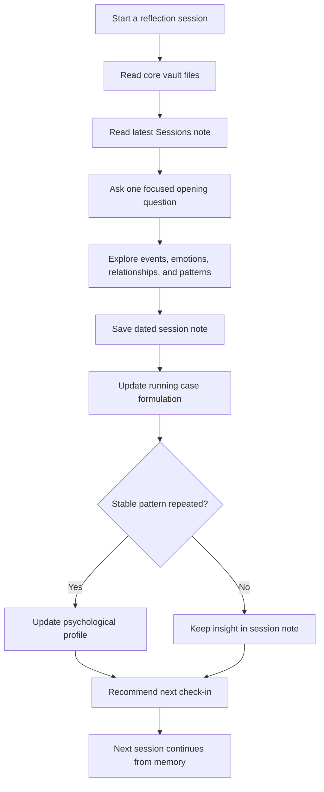

# Psychology Reflection Vault

**Idiomas:** [English](./README.md) | [简体中文](./README.zh-CN.md) | [日本語](./README.ja.md) | [Español](./README.es.md) | [Français](./README.fr.md)

[](./LICENSE)
[](./08_Public_Private_Workflow.md)
[](https://obsidian.md/)
[](./02_Therapy_Framework.md)

Una plantilla estilo Obsidian para construir un sistema privado, continuo y asistido por IA para reflexión psicológica.

La mayoría de los chats con IA olvidan el contexto. Este vault da memoria al proceso: notas de sesión, formulación de caso, perfil psicológico a largo plazo, lógica de programación y revisiones mensuales o anuales.

> Importante: Este proyecto no es terapia, diagnóstico médico, atención psiquiátrica ni intervención en crisis. Si estás en peligro inmediato, en riesgo de autolesión o de hacer daño a otra persona, contacta de inmediato con servicios de emergencia, un profesional cualificado o una persona de confianza.

## Highlights

- **Continuidad entre sesiones**: cada conversación hereda notas anteriores.
- **Estructura nativa de Obsidian**: archivos Markdown legibles, editables y portables.
- **Memoria por capas**: separa hechos, emociones, interpretaciones, patrones, perfil, riesgos y próximas preguntas.
- **Flujo público/privado**: este repositorio es plantilla pública; el material real va en un vault privado.
- **Programación adaptativa**: recomienda el próximo seguimiento según intensidad emocional, temas pendientes y estabilidad.

## Quick Start

1. Haz clic en **Use this template** o haz fork del repositorio.
2. Si guardarás material personal real, mantén tu vault en **private**.
3. Abre la carpeta en [Obsidian](https://obsidian.md/) o en cualquier editor Markdown.
4. Completa `01_Client_Profile.md` con el contexto que quieres que recuerde tu asistente de IA.
5. Empieza con este prompt:

```text
Read the core vault files and the latest note in Sessions/.
Continue from the existing psychological reflection system.
Start with one focused opening question.
```

6. Después de la sesión, copia `04_Session_Template.md` en `Sessions/` y guárdalo con fecha.
7. Actualiza `03_Running_Case_Formulation.md`, y actualiza `05_Psychological_Profile.md` solo cuando un patrón estable sea más claro.

## Use Cases

- vault personal de reflexión con IA;
- sistema de conocimiento personal en Obsidian;
- plantilla de coaching o journaling;
- ejemplo de diseño de memoria a largo plazo para IA;
- organización personal sin reemplazar atención profesional.

## How It Works



## Community

- [CONTRIBUTING.md](./CONTRIBUTING.md)
- [CODE_OF_CONDUCT.md](./CODE_OF_CONDUCT.md)
- [ROADMAP.md](./ROADMAP.md)

## Licencia

MIT
