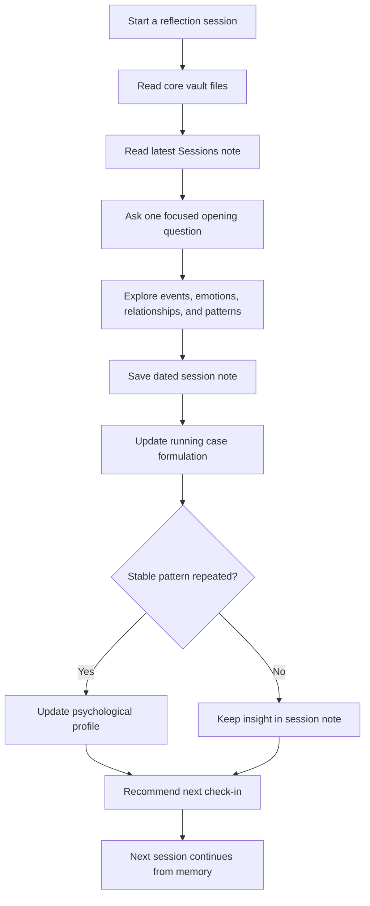

# Psychology Reflection Vault

**Langues :** [English](./README.md) | [简体中文](./README.zh-CN.md) | [日本語](./README.ja.md) | [Español](./README.es.md) | [Français](./README.fr.md) | [Deutsch](./README.de.md) | [한국어](./README.ko.md) | [Português](./README.pt-BR.md) | [Русский](./README.ru.md) | [العربية](./README.ar.md)

[](./LICENSE)
[](./08_Public_Private_Workflow.md)
[](https://obsidian.md/)
[](./02_Therapy_Framework.md)

Un modèle de type Obsidian pour créer un système privé, continu et assisté par IA de réflexion psychologique.

La plupart des conversations avec l'IA oublient le contexte. Ce vault donne une mémoire au processus : notes de séance, formulation de cas, profil psychologique à long terme, logique de planification et bilans mensuels ou annuels.

> Important : ce projet n'est pas une thérapie, un diagnostic médical, un soin psychiatrique ni une intervention de crise. Si vous êtes en danger immédiat, à risque d'automutilation ou susceptible de blesser quelqu'un d'autre, contactez immédiatement les services d'urgence locaux, un professionnel qualifié ou une personne de confiance.

## Highlights

- **Continuité entre les séances** : chaque conversation peut reprendre les notes précédentes.
- **Structure native Obsidian** : fichiers Markdown lisibles, modifiables et portables.
- **Mémoire en couches** : sépare faits, émotions, interprétations, schémas, profil, risques et prochaines questions.
- **Flux public/privé** : ce dépôt reste un modèle public, les données réelles restent dans un vault privé.
- **Planification adaptative** : recommande le prochain suivi selon l'intensité émotionnelle, les thèmes ouverts et la stabilité.

## Quick Start

1. Cliquez sur **Use this template** ou forkez ce dépôt.
2. Si vous stockez du contenu personnel réel, gardez votre vault en **private**.
3. Ouvrez le dossier dans [Obsidian](https://obsidian.md/) ou tout éditeur Markdown.
4. Remplissez `01_Client_Profile.md` avec le contexte que vous souhaitez transmettre à votre assistant IA.
5. Commencez avec ce prompt :

```text
Read the core vault files and the latest note in Sessions/.
Continue from the existing psychological reflection system.
Start with one focused opening question.
```

6. Après la séance, copiez `04_Session_Template.md` dans `Sessions/` et nommez le fichier avec une date.
7. Mettez à jour `03_Running_Case_Formulation.md`, et `05_Psychological_Profile.md` seulement lorsqu'un schéma stable devient plus clair.

## Use Cases

- vault personnel de réflexion avec IA ;
- système de connaissance personnelle dans Obsidian ;
- modèle de coaching ou de journal ;
- exemple de conception de mémoire IA à long terme ;
- organisation personnelle sans remplacer un accompagnement professionnel.

## How It Works



## Community

- [CONTRIBUTING.md](./CONTRIBUTING.md)
- [CODE_OF_CONDUCT.md](./CODE_OF_CONDUCT.md)
- [ROADMAP.md](./ROADMAP.md)

## Licence

MIT
