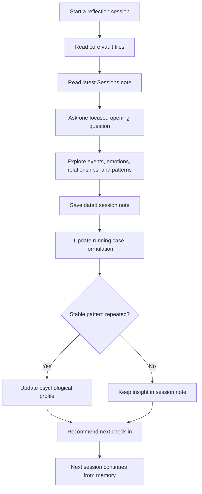

# Psychology Reflection Vault

**言語:** [English](./README.md) | [简体中文](./README.zh-CN.md) | [日本語](./README.ja.md) | [Español](./README.es.md) | [Français](./README.fr.md)

[](./LICENSE)
[](./08_Public_Private_Workflow.md)
[](https://obsidian.md/)
[](./02_Therapy_Framework.md)

プライベートで継続的な AI 支援の心理的リフレクションシステムを作るための Obsidian 形式テンプレートです。

多くの AI チャットは文脈を忘れます。この vault は、セッションノート、継続的なケースフォーミュレーション、長期的な心理プロフィール、スケジューリング、月次・年次レビューを通して、リフレクションに記憶を持たせます。

> 重要: このプロジェクトは心理療法、医学的診断、精神科医療、危機介入ではありません。差し迫った危険、自傷のリスク、または他者を傷つけるリスクがある場合は、直ちに地域の緊急サービス、資格を持つ専門家、または信頼できる人に連絡してください。

## Highlights

- **継続性**: 各セッションが以前のノートを引き継ぎます。
- **Obsidian ネイティブ**: 読みやすく編集しやすい Markdown ファイルです。
- **階層化された記憶**: 事実、感情、解釈、反復パターン、プロフィール更新、リスク、次の問いを分けます。
- **public/private 分離**: public にはテンプレートのみ、実際の個人内容は private vault に保存します。
- **適応的スケジューリング**: 感情の強さ、未完了のテーマ、安定度に基づいて次回を提案します。

## Quick Start

1. **Use this template** をクリックするか、このリポジトリを fork します。
2. 実際の個人的な内容を保存する場合は、作業用 vault を **private** にします。
3. [Obsidian](https://obsidian.md/) または任意の Markdown エディタで開きます。
4. `01_Client_Profile.md` に AI に覚えてほしい背景を記入します。
5. 次のプロンプトで開始します。

```text
Read the core vault files and the latest note in Sessions/.
Continue from the existing psychological reflection system.
Start with one focused opening question.
```

6. セッション後、`04_Session_Template.md` を `Sessions/` にコピーし、日付で保存します。
7. `03_Running_Case_Formulation.md` を更新し、安定したパターンが明確になった場合のみ `05_Psychological_Profile.md` を更新します。

## Use Cases

- 個人用 AI リフレクション vault
- Obsidian 個人知識システム
- コーチングやジャーナリングのテンプレート
- AI 長期記憶設計の例
- 専門的支援を置き換えない自己整理ツール

## How It Works



## Community

- [CONTRIBUTING.md](./CONTRIBUTING.md)
- [CODE_OF_CONDUCT.md](./CODE_OF_CONDUCT.md)
- [ROADMAP.md](./ROADMAP.md)

## License

MIT
