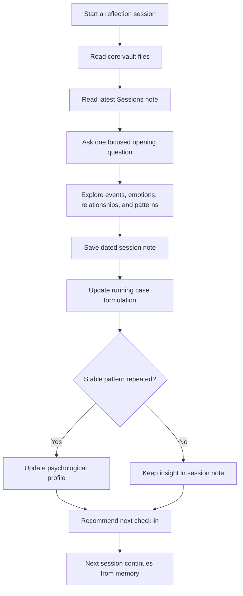
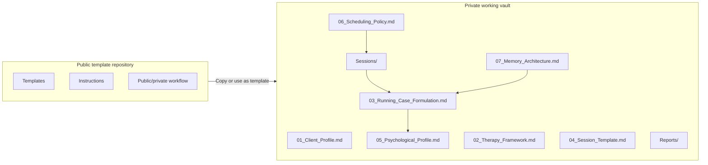

# Psychology Reflection Vault

**Languages:** [English](./README.md) | [简体中文](./README.zh-CN.md) | [日本語](./README.ja.md) | [Español](./README.es.md) | [Français](./README.fr.md)

[](./LICENSE)
[](./08_Public_Private_Workflow.md)
[](https://obsidian.md/)
[](./02_Therapy_Framework.md)

An Obsidian-style template for building a private, continuous, AI-assisted psychological reflection system.

Most AI chats forget who you are. This vault gives your reflection process memory: session notes, running case formulation, long-term psychological profile, scheduling logic, and monthly or yearly review.

> Important: This project is not therapy, medical diagnosis, psychiatric care, or crisis intervention. If you are in immediate danger, at risk of self-harm, or at risk of harming someone else, contact local emergency services, a qualified professional, or a trusted person immediately.

## Highlights

- **Continuity across sessions**: every conversation can inherit previous notes instead of starting from zero.
- **Obsidian-native structure**: plain Markdown files that are readable, editable, and portable.
- **Layered memory system**: separates facts, emotions, interpretations, recurring patterns, profile updates, risk notes, and next questions.
- **Public/private workflow**: keep this repository public as a template while storing real personal material in a private vault.
- **Adaptive scheduling**: recommend the next check-in based on emotional intensity, unfinished material, and stability.
- **Multilingual README entry points**: English, Simplified Chinese, Japanese, Spanish, and French.

## Quick Start

1. Click **Use this template** or fork this repository.
2. Create your own working vault. If it will contain real personal material, keep it **private**.
3. Open the folder in [Obsidian](https://obsidian.md/) or any Markdown editor.
4. Fill in `01_Client_Profile.md` with only the background you want your AI assistant to remember.
5. Start a reflection session with this prompt:

```text
Read the core vault files and the latest note in Sessions/.
Continue from the existing psychological reflection system.
Start with one focused opening question.
```

6. After the session, copy `04_Session_Template.md` into `Sessions/` and save it with a date-based filename.
7. Update `03_Running_Case_Formulation.md`, and update `05_Psychological_Profile.md` only when a stable pattern becomes clearer.

## Use Cases

- **Personal AI reflection vault**: build continuity across weekly self-reflection conversations.
- **Obsidian personal knowledge system**: connect emotional patterns, life events, and long-term self-understanding.
- **Coaching or journaling template**: structure recurring reflective conversations without storing private data in an app.
- **AI memory design example**: study how to separate short-term session notes from long-term profile memory.
- **Therapy-adjacent self-organization**: organize thoughts before or after professional therapy without replacing professional care.

## Who This Is For

- people who already use AI for journaling or reflection;
- Obsidian users who want a structured personal vault;
- builders studying long-term AI memory design;
- coaches, educators, or facilitators designing reusable reflection templates;
- people who want a private self-organization system around therapy-adjacent topics.

## Who This Is Not For

- anyone seeking emergency mental health support;
- anyone looking for medical diagnosis or treatment;
- teams that want to collect sensitive user data;
- public repositories containing real personal session notes.

## How It Works



## Vault Architecture



## Repository Structure

```text
.
├── 00_Start_Here.md
├── 01_Client_Profile.md
├── 02_Therapy_Framework.md
├── 03_Running_Case_Formulation.md
├── 04_Session_Template.md
├── 05_Psychological_Profile.md
├── 06_Scheduling_Policy.md
├── 07_Memory_Architecture.md
├── 08_Public_Private_Workflow.md
├── Sessions/
├── Reports/
├── docs/
├── examples/
├── CONTRIBUTING.md
├── CODE_OF_CONDUCT.md
├── SUPPORT.md
├── SECURITY.md
├── ROADMAP.md
├── CHANGELOG.md
└── TRANSLATIONS.md
```

## Docs And Examples

- [Getting Started](./docs/GETTING_STARTED.md)
- [Prompt Recipes](./docs/PROMPT_RECIPES.md)
- [Privacy And Safety Checklist](./docs/PRIVACY_AND_SAFETY.md)
- [FAQ](./docs/FAQ.md)
- [Fictional Session Note Example](./examples/fictional-session-note.md)
- [Fictional Monthly Report Example](./examples/monthly-report-example.md)

## Public vs Private

This public repository is only a template. It should contain reusable structure, instructions, and blank templates.

Your real personal reflections should live in a separate private repository or local folder. Do not publish real session notes, personal history, relationship details, risk notes, contact information, health details, or anything you would not want strangers to read.

See [Public And Private Vault Workflow](./08_Public_Private_Workflow.md) for the recommended setup.

## Community

Contributions are welcome when they improve the template without adding private or clinical claims.

- Read [CONTRIBUTING.md](./CONTRIBUTING.md) before opening a pull request.
- Review [CODE_OF_CONDUCT.md](./CODE_OF_CONDUCT.md) for community expectations.
- Read [SUPPORT.md](./SUPPORT.md) for where to ask questions.
- See [ROADMAP.md](./ROADMAP.md) for planned improvements.
- See [CHANGELOG.md](./CHANGELOG.md) for project history.
- Use the issue templates to report problems or propose improvements.

## README Translations

GitHub does not provide a built-in README language switch. This project uses separate localized README files and links them at the top of each file:

```text
README.md
README.zh-CN.md
README.ja.md
README.es.md
README.fr.md
```

See [TRANSLATIONS.md](./TRANSLATIONS.md) for the localization maintenance policy.

## License

MIT
