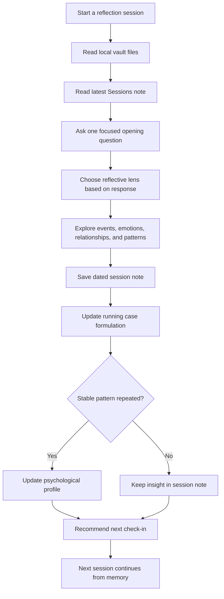
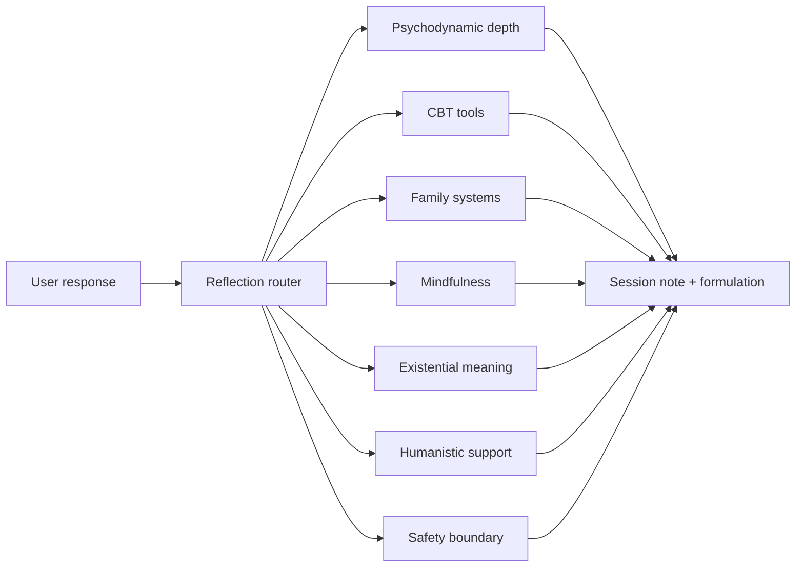
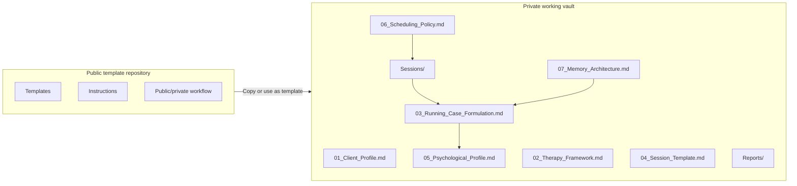

# Psychology Reflection Vault

**Languages:** [English](./README.md) | [简体中文](./README.zh-CN.md) | [日本語](./README.ja.md) | [Español](./README.es.md) | [Français](./README.fr.md) | [Deutsch](./README.de.md) | [한국어](./README.ko.md) | [Português](./README.pt-BR.md) | [Русский](./README.ru.md) | [العربية](./README.ar.md)

[](./LICENSE)
[](./08_Public_Private_Workflow.md)
[](https://obsidian.md/)
[](./02_Therapy_Framework.md)
[](./docs/PRIVACY_AND_SAFETY.md)

[Overview](#overview) · [Core Advantages](#core-advantages) · [Strategy Routing](#adaptive-strategy-routing) · [Long-term Memory](#long-term-memory-system) · [Privacy Model](#privacy-model) · [Public vs Private](#public-template-private-vault) · [Quick Start](#quick-start) · [Docs](#docs-and-examples) · [Translations](#readme-translations)

## Overview

Build a **private, local-first, AI-assisted psychological reflection vault** that remembers the previous session, adapts its reflective strategy, and turns scattered conversations into a long-term self-understanding system.

Most AI chats start from zero. Psychology Reflection Vault gives your reflection process durable memory: session notes, running case formulation, long-term psychological profile, adaptive scheduling, privacy boundaries, and monthly or yearly review.

> Important: This project is not therapy, medical diagnosis, psychiatric care, or crisis intervention. If you are in immediate danger, at risk of self-harm, or at risk of harming someone else, contact local emergency services, a qualified professional, or a trusted person immediately.

## Core Advantages

- **Local-first privacy architecture**: your working vault is plain Markdown on your own device or in your own private repository. The project has no hosted backend, no project server, no hidden database, and no built-in telemetry.
- **Adaptive psychological strategy routing**: the assistant can shift its reflective lens based on what the user says, instead of forcing every session into one fixed coaching or journaling style.
- **Visible long-term memory**: memory is stored in readable files, not a black-box product database. You can inspect, edit, remove, or migrate it at any time.
- **Layered personality and pattern formation**: session notes stay concrete, running formulations stay tentative, and the psychological profile is updated only when stable patterns become clearer.
- **Public template, private personal vault**: this repository can stay public because it contains reusable structure, instructions, and fictional examples. Real reflections belong in a separate private vault.
- **Obsidian and Markdown native**: the system works with Obsidian, VS Code, any Markdown editor, and any AI assistant that can read local files.
- **Model-agnostic and editor-agnostic**: the vault is a file architecture, not a proprietary platform. You choose your editor and AI provider.
- **Multilingual entry points**: localized README files help users enter the same template from different languages while keeping their private vault in their preferred language.

## Why This Is Different

### 1. Local-first privacy by design

This repository is a plain Markdown vault. There is no hosted backend, no project server, no hidden database, and no built-in telemetry. Your working files can stay on your own device or in your own private repository.

That matters for psychological reflection: the most sensitive material should not be forced into a third-party app database just to gain continuity.

Privacy note: if you choose to paste or connect your vault content to a cloud AI service, that service may receive the content you provide. The vault itself is local-first; your AI provider choice determines any external data transmission.

### 2. Adaptive multi-strategy reflection

The vault is designed for an AI assistant that can switch reflective lenses based on what the user actually says. It is not locked into one style.

Depending on the session, the assistant may lean toward:

- psychodynamic or psychoanalytic exploration for recurring emotional conflicts, defenses, shame, attachment, and self-worth;
- cognitive-behavioral tools for rumination, avoidance, anxiety loops, and concrete action difficulty;
- family-systems thinking for family roles, loyalty conflicts, and relationship patterns;
- mindfulness-based reflection for body signals, emotional regulation, and attention;
- existential reflection for meaning, freedom, loneliness, responsibility, and life direction;
- humanistic support for warmth, acceptance, and stable emotional holding;
- safety-first crisis boundaries when ordinary reflection is not appropriate.

### 3. Long-term memory without black boxes

Instead of hiding memory inside an app, this vault makes memory visible and editable:

- `Sessions/` keeps concrete session records.
- `03_Running_Case_Formulation.md` keeps evolving hypotheses.
- `05_Psychological_Profile.md` stores only stable, repeated patterns.
- `07_Memory_Architecture.md` prevents one emotional moment from becoming a permanent label.

### 4. Public template, private life

This repository can be public because it contains only structure, prompts, examples, and blank templates. Your real reflections should live in a separate private vault.

### 5. Model-agnostic and editor-agnostic

Use it with Obsidian, VS Code, any Markdown editor, and any AI assistant that can read files. The system is the file architecture, not a proprietary platform.

## Highlights

- **Local-first privacy**: plain Markdown, no backend, no required account beyond your chosen tools.
- **Adaptive psychological strategy routing**: shifts between depth exploration, CBT-style tools, family systems, mindfulness, existential reflection, and safety boundaries.
- **Continuity across sessions**: every conversation can inherit previous notes instead of starting from zero.
- **Layered memory architecture**: separates facts, emotions, interpretations, recurring patterns, profile updates, risk notes, and next questions.
- **Obsidian-native structure**: readable, editable, portable files.
- **Adaptive scheduling**: recommend the next check-in based on emotional intensity, unfinished material, and stability.
- **Multilingual README entry points**: English, Chinese, Japanese, Spanish, French, German, Korean, Portuguese, Russian, and Arabic.

## Privacy Model

The privacy model is intentionally simple:

- the public repository contains templates, instructions, docs, and fictional examples;
- your real working vault should stay local or private;
- the project itself does not provide a server, hosted account system, hidden database, or telemetry layer;
- all important memory files are plain Markdown and can be reviewed directly;
- any external data transmission depends on the AI assistant, sync service, or cloud provider you choose to use.

This design is especially important for psychological reflection because sensitive material should not be locked inside an opaque product memory system just to preserve continuity.

## Quick Start

1. Click **Use this template** or fork this repository.
2. Create your own working vault. If it will contain real personal material, keep it **private**.
3. Open the folder in [Obsidian](https://obsidian.md/) or any Markdown editor.
4. Fill in `01_Client_Profile.md` with only the background you want your AI assistant to remember.
5. Start a reflection session with this prompt:

```text
Read the core vault files and the latest note in Sessions/.
Continue from the existing psychological reflection system.
Start with one focused opening question.
```

6. After the session, copy `04_Session_Template.md` into `Sessions/` and save it with a date-based filename.
7. Update `03_Running_Case_Formulation.md`, and update `05_Psychological_Profile.md` only when a stable pattern becomes clearer.

## Use Cases

- **Personal AI reflection vault**: build continuity across weekly self-reflection conversations.
- **Obsidian personal knowledge system**: connect emotional patterns, life events, and long-term self-understanding.
- **Coaching or journaling template**: structure recurring reflective conversations without storing private data in an app.
- **AI memory design example**: study how to separate short-term session notes from long-term profile memory.
- **Therapy-adjacent self-organization**: organize thoughts before or after professional therapy without replacing professional care.

## Who This Is For

- people who already use AI for journaling or reflection;
- Obsidian users who want a structured personal vault;
- builders studying long-term AI memory design;
- coaches, educators, or facilitators designing reusable reflection templates;
- people who want a private self-organization system around therapy-adjacent topics.

## Who This Is Not For

- anyone seeking emergency mental health support;
- anyone looking for medical diagnosis or treatment;
- teams that want to collect sensitive user data;
- public repositories containing real personal session notes.

## How It Works



## Adaptive Strategy Routing

The project is designed around adaptive psychological strategy routing. The assistant should read the user's current response and choose the most useful reflective lens for that moment:

- **Psychodynamic or psychoanalytic**: recurring emotional conflicts, defenses, shame, attachment, self-worth, and relationship repetition.
- **CBT-style tools**: rumination, avoidance, anxiety loops, cognitive distortions, action difficulty, and concrete behavior planning.
- **Family systems**: family roles, loyalty conflicts, boundaries, inherited expectations, and relationship structure.
- **Mindfulness-based reflection**: body signals, attention, emotional regulation, and observing experience without immediate over-analysis.
- **Existential reflection**: meaning, freedom, responsibility, loneliness, mortality, choice, and life direction.
- **Humanistic support**: warmth, acceptance, emotional holding, self-compassion, and nonjudgmental exploration.
- **Safety boundary**: crisis risk, self-harm intent, harm-to-others risk, or situations where ordinary reflection is not appropriate.



## Long-term Memory System

The vault separates different levels of memory so one emotional moment does not become a permanent identity label:

- `Sessions/` stores concrete dated records: what happened, what was felt, what was discussed, and what should be revisited.
- `03_Running_Case_Formulation.md` stores evolving hypotheses about repeated conflicts, relationship patterns, defenses, needs, and growth signals.
- `05_Psychological_Profile.md` stores stable patterns only when enough repeated evidence exists.
- `Reports/` turns many sessions into monthly or yearly synthesis.
- `07_Memory_Architecture.md` defines how to separate raw events, emotions, interpretations, recurring patterns, profile updates, risk notes, and next-question logic.

The core rule is: **one moment is not a personality**. Stable profile updates should come from repeated patterns, context, and careful interpretation.

## Vault Architecture



## Repository Structure

```text
.
├── 00_Start_Here.md
├── 01_Client_Profile.md
├── 02_Therapy_Framework.md
├── 03_Running_Case_Formulation.md
├── 04_Session_Template.md
├── 05_Psychological_Profile.md
├── 06_Scheduling_Policy.md
├── 07_Memory_Architecture.md
├── 08_Public_Private_Workflow.md
├── Sessions/
├── Reports/
├── docs/
├── examples/
├── CONTRIBUTING.md
├── CODE_OF_CONDUCT.md
├── SUPPORT.md
├── SECURITY.md
├── ROADMAP.md
├── CHANGELOG.md
└── TRANSLATIONS.md
```

## Docs And Examples

- [Getting Started](./docs/GETTING_STARTED.md)
- [Prompt Recipes](./docs/PROMPT_RECIPES.md)
- [Privacy And Safety Checklist](./docs/PRIVACY_AND_SAFETY.md)
- [FAQ](./docs/FAQ.md)
- [Fictional Session Note Example](./examples/fictional-session-note.md)
- [Fictional Monthly Report Example](./examples/monthly-report-example.md)

## Public Template, Private Vault

This public repository is only a template. It should contain reusable structure, instructions, fictional examples, and blank templates.

Your real personal reflections should live in a separate private repository or local folder. Do not publish real session notes, personal history, relationship details, risk notes, contact information, health details, or anything you would not want strangers to read.

See [Public And Private Vault Workflow](./08_Public_Private_Workflow.md) for the recommended setup.

## Community

Contributions are welcome when they improve the template without adding private material or clinical claims.

- Read [CONTRIBUTING.md](./CONTRIBUTING.md) before opening a pull request.
- Review [CODE_OF_CONDUCT.md](./CODE_OF_CONDUCT.md) for community expectations.
- Read [SUPPORT.md](./SUPPORT.md) for where to ask questions.
- See [ROADMAP.md](./ROADMAP.md) for planned improvements.
- See [CHANGELOG.md](./CHANGELOG.md) for project history.
- Use the issue templates to report problems or propose improvements.

## README Translations

GitHub does not provide a built-in README language switch. This project uses separate localized README files and links them at the top of each file.

See [TRANSLATIONS.md](./TRANSLATIONS.md) for the localization maintenance policy.

## License

MIT
