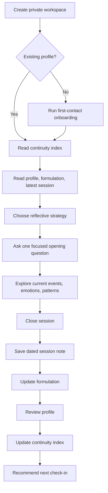

# AI-Assisted Psychological Reflection

[](./LICENSE)
[](./docs/PRIVACY_AND_SAFETY.md)
[](./skill/psychology-reflection/SKILL.md)
[](./07_Memory_Architecture.md)

AI-Assisted Psychological Reflection is a local-first template for recurring, psychologically informed reflection with durable continuity. It helps an AI assistant read prior context, ask one focused opening question, close each session cleanly, and update visible Markdown memory without turning every passing emotion into a permanent label.

> This project is not licensed psychotherapy, medical diagnosis, psychiatric care, or crisis intervention. It is a structured self-reflection and continuity system. If you are in immediate danger, at risk of self-harm, or at risk of harming someone else, contact local emergency services, a qualified professional, or a trusted person immediately.

## Section Index

- [Why this exists](#why-this-exists)
- [Feature index](#feature-index)
- [Quick start](#quick-start)
- [Install as an agent skill](#install-as-an-agent-skill)
- [How the workflow runs](#how-the-workflow-runs)
- [Conversation experience](#conversation-experience)
- [Long-term operation model](#long-term-operation-model)
- [Public template and private workspace](#public-template-and-private-workspace)
- [Repository structure](#repository-structure)
- [Docs and examples](#docs-and-examples)
- [Community and maintenance](#community-and-maintenance)

## Why This Exists

Ordinary AI chats often start from zero. Psychological reflection needs a different shape: continuity, restraint, privacy, session rhythm, and a memory system the user can inspect and correct.

This repository provides that structure with plain Markdown files:

- session notes for concrete weekly material;
- a running case formulation for evolving hypotheses;
- a psychological profile for stable or repeated patterns;
- an adaptive scheduling policy for the next check-in;
- a continuity index so future sessions can find the right context quickly;
- public/private workflow rules so real personal notes do not leak into a public repository.

## Feature Index

Each item links to the detailed explanation below.

1. [Local-first privacy architecture](#1-local-first-privacy-architecture)
2. [Installable agent skill workflow](#2-installable-agent-skill-workflow)
3. [First-contact onboarding](#3-first-contact-onboarding)
4. [Therapy-informed reflection workflow](#4-therapy-informed-reflection-workflow)
5. [Adaptive psychological strategy routing](#5-adaptive-psychological-strategy-routing)
6. [Visible long-term memory](#6-visible-long-term-memory)
7. [Session-based memory updates](#7-session-based-memory-updates)
8. [Layered personality and pattern formation](#8-layered-personality-and-pattern-formation)
9. [Public template, private workspace](#9-public-template-private-workspace)
10. [Local file native and portable](#10-local-file-native-and-portable)
11. [Model-agnostic and multilingual-ready](#11-model-agnostic-and-multilingual-ready)
12. [Dream mini-sessions](#12-dream-mini-sessions)

### 1. Local-first privacy architecture

Psychological material is sensitive. This project keeps the durable memory layer in local Markdown files instead of a hidden hosted database. Users can inspect, edit, remove, or move every important note.

The template itself has no project server, account system, telemetry layer, or database. If the user connects a cloud AI assistant or sync tool, that separate provider may receive whatever the user chooses to send, but the repository remains local-first by design.

### 2. Installable agent skill workflow

The repository can be installed as an agent skill for Codex and Claude Code-style skill directories. The skill gives the assistant a reusable workflow: read the vault, ask one opening question, conduct a bounded session, close clearly, and update the right memory files.

The goal is practical adoption. A user should be able to clone or download the repository, run one installer, and start a structured reflection session without manually copying a long prompt.

### 3. First-contact onboarding

The first session should not jump straight into interpretation. The onboarding flow starts with live-session language, mother tongue or emotionally natural language, role boundaries, privacy preferences, current goals, preferred response style, and the user's expectations.

The user may skip any question. The result is a light starting profile, not a diagnosis or clinical assessment.

The standardized questionnaire is in [First-Contact Onboarding Questionnaire](./docs/ONBOARDING_QUESTIONNAIRE.md). It uses a psychotherapy-intake-inspired structure covering language, privacy, purpose, current concern, functional impact, emotional baseline, safety, support, relationship context, repeating patterns, continuity preferences, and optional dream tracking.

### 4. Therapy-informed reflection workflow

The workflow resembles a recurring reflective appointment:

1. Read the local rules and continuity files.
2. Use the continuity index to avoid rereading the entire archive.
3. Ask one focused opening question.
4. Explore the current issue with appropriate psychological lenses.
5. Begin closing once the main theme is clear.
6. Save a dated session note.
7. Update only the memory files that actually changed.
8. Recommend the next check-in time.

The assistant must not claim to be a licensed therapist, psychiatrist, emergency service, or medical provider.

### 5. Adaptive psychological strategy routing

Different material needs different responses. A family conflict may call for family-systems reflection; procrastination may need CBT-style tools; shame or repeated relationship patterns may need psychodynamic depth; meaning questions may need existential exploration; risk signals require safety-first handling.

See [Adaptive Strategy Routing](./docs/STRATEGY_ROUTING.md) for the routing rules.

### 6. Visible long-term memory

Long-term AI memory should not be a black box. This project stores memory in readable files:

- `Sessions/` for dated session notes;
- `03_Running_Case_Formulation.md` for evolving hypotheses;
- `05_Psychological_Profile.md` for stable or repeated patterns;
- `09_Continuity_Index.md` for quick routing;
- `Reports/` for monthly and yearly synthesis.

The user can review, correct, or delete any part of the memory.

### 7. Session-based memory updates

Durable memory is updated after a session closes, not after every message. This protects the profile from overreacting to temporary emotion and lets the assistant understand the whole arc before writing lasting notes.

The core rule is: conversation first, documentation after.

### 8. Layered personality and pattern formation

The memory architecture separates facts, emotions, interpretations, recurring patterns, profile updates, risk notes, and next-question logic. A user fact is not the same as an assistant hypothesis. A single intense moment is not automatically a stable personality trait.

This helps the project support depth without premature labeling.

### 9. Public template, private workspace

The public repository should contain reusable templates, rules, fictional examples, and installable skill files. Real session notes, personal history, relationship details, health information, identity information, and risk material belong only in a local or private workspace.

See [Public Template And Private Workspace Workflow](./08_Public_Private_Workflow.md).

### 10. Local file native and portable

The system works with ordinary files. It can be opened in Obsidian, VS Code, a local file manager, a private Git repository, or an AI workspace with file access.

Plain Markdown makes the user's continuity portable across tools.

### 11. Model-agnostic and multilingual-ready

The method is a workflow and memory architecture, not a proprietary model wrapper. It can be adapted to different AI assistants, editors, private repositories, and future apps.

Formal project files are maintained in English. Translation policy and future localization work are tracked in [TRANSLATIONS.md](./TRANSLATIONS.md).

### 12. Dream mini-sessions

The project supports optional dream-based mini-sessions. A dream mini-session is a brief supplemental conversation, not a full weekly session or diagnostic process.

It can capture the dream, waking emotion, the user's own associations, and a tentative theme. The output is user-selected: no summary, a one-sentence takeaway, a brief private note, a structured dream note, or a carry-forward note. Dream material is carried into full-session continuity only when the user permits it, the theme repeats, or the current session clearly makes it relevant.

See [Dream Mini-Session Workflow](./docs/DREAM_MINI_SESSION.md).

## Quick Start

1. Clone, download, or use this repository as a template.
2. Keep this public template separate from any private working vault.
3. For a private vault, copy the template files into a local or private folder.
4. Run first-contact onboarding with [docs/ONBOARDING_QUESTIONNAIRE.md](./docs/ONBOARDING_QUESTIONNAIRE.md).
5. Optionally use [docs/DREAM_MINI_SESSION.md](./docs/DREAM_MINI_SESSION.md) for brief dream-based reflections.
6. Start each full session with the prompt in [docs/PROMPT_RECIPES.md](./docs/PROMPT_RECIPES.md).
7. After each completed session, save a dated note under `Sessions/`.
8. Update `03_Running_Case_Formulation.md`, review `05_Psychological_Profile.md`, update `09_Continuity_Index.md`, and recommend the next check-in time.

## Install As An Agent Skill

From a cloned or downloaded copy of this repository:

```bash
./install.sh
```

On macOS, users can also double-click:

```text
install.command
```

Install for Claude Code-style skill directories:

```bash
./install.sh --agent claude-code
```

Install for both supported targets:

```bash
./install.sh --agent all
```

After installation, invoke the skill with:

```text
Use $psychology-reflection to start a structured reflection session.
```

One-line install after publishing this repository:

```bash
curl -fsSL https://raw.githubusercontent.com/126mingxuan/ai-assisted-therapy-support/main/install.sh | bash
```

## How The Workflow Runs


```mermaid
flowchart TD
    A["Create private workspace"] --> B{"Existing profile?"}
    B -- "No" --> C["Run first-contact onboarding"]
    B -- "Yes" --> D["Read continuity index"]
    C --> D
    D --> E["Read profile, formulation, latest session"]
    E --> F["Choose reflective strategy"]
    F --> G["Ask one focused opening question"]
    G --> H["Explore current events, emotions, patterns"]
    H --> I["Close session"]
    I --> J["Save dated session note"]
    J --> K["Update formulation"]
    K --> L["Review profile"]
    L --> M["Update continuity index"]
    M --> N["Recommend next check-in"]
```

## Conversation Experience

The project is optimized for timely feedback:

- start with one question, not a long analysis;
- use short bridge summaries when reading prior context;
- acknowledge emotional intensity before giving tools;
- keep interventions to one or two useful next moves;
- close the session once the main theme is organized;
- write durable notes only after the session has a clear stopping point.

See [Conversation Experience](./docs/CONVERSATION_EXPERIENCE.md).

## Long-Term Operation Model

Long-term use depends on compression and review:

- `09_Continuity_Index.md` keeps the latest routing map;
- monthly reports summarize repeated themes when enough material exists;
- yearly reports summarize long-term change and next-year direction;
- stale hypotheses should be retired instead of carried forward forever;
- private notes should stay local or private, even when the template repository is public.
- dream notes should stay brief, optional, private, and separate from full sessions unless a repeated theme becomes relevant.

## Public Template And Private Workspace

This repository is designed to be public-safe. A real user's working vault should be separate.

Before publishing:

- keep real `Sessions/*.md` ignored unless they are fictional examples;
- keep real `Dreams/*.md` ignored unless they are fictional examples;
- keep real monthly and yearly reports ignored;
- remove identity, contact, health, financial, relationship, and crisis details from public files;
- use `examples/` for fictional material only;
- review [Privacy And Safety Checklist](./docs/PRIVACY_AND_SAFETY.md).

## Repository Structure

```text
.
├── AGENTS.md
├── README.md
├── 00_Start_Here.md
├── 01_Client_Profile.md
├── 02_Therapy_Framework.md
├── 03_Running_Case_Formulation.md
├── 04_Session_Template.md
├── 05_Psychological_Profile.md
├── 06_Scheduling_Policy.md
├── 07_Memory_Architecture.md
├── 08_Public_Private_Workflow.md
├── 09_Continuity_Index.md
├── Sessions/
├── Dreams/
├── Reports/
├── docs/
├── examples/
├── skill/psychology-reflection/
├── scripts/
└── .github/
```

## Docs And Examples

- [Getting Started](./docs/GETTING_STARTED.md)
- [Session Lifecycle](./docs/SESSION_LIFECYCLE.md)
- [First-Contact Onboarding Questionnaire](./docs/ONBOARDING_QUESTIONNAIRE.md)
- [Dream Mini-Session Workflow](./docs/DREAM_MINI_SESSION.md)
- [Adaptive Strategy Routing](./docs/STRATEGY_ROUTING.md)
- [Conversation Experience](./docs/CONVERSATION_EXPERIENCE.md)
- [Prompt Recipes](./docs/PROMPT_RECIPES.md)
- [Privacy And Safety Checklist](./docs/PRIVACY_AND_SAFETY.md)
- [FAQ](./docs/FAQ.md)
- [Public Template And Private Workspace Workflow](./08_Public_Private_Workflow.md)
- [Continuity Index](./09_Continuity_Index.md)
- [Fictional Session Note Example](./examples/fictional-session-note.md)
- [Fictional Full Session Lifecycle Example](./examples/full-session-lifecycle-example.md)
- [Fictional Monthly Report Example](./examples/monthly-report-example.md)

## Community And Maintenance

- [Contributing](./CONTRIBUTING.md)
- [Code of Conduct](./CODE_OF_CONDUCT.md)
- [Support](./SUPPORT.md)
- [Security](./SECURITY.md)
- [Roadmap](./ROADMAP.md)
- [Changelog](./CHANGELOG.md)
- [Translations](./TRANSLATIONS.md)

## License

MIT. See [LICENSE](./LICENSE).
