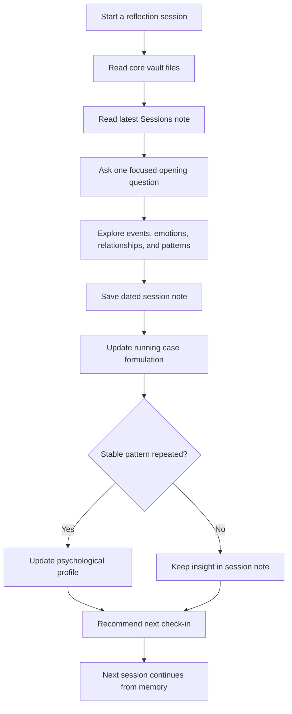

# Psychology Reflection Vault

**语言：** [English](./README.md) | [简体中文](./README.zh-CN.md) | [日本語](./README.ja.md) | [Español](./README.es.md) | [Français](./README.fr.md)

[](./LICENSE)
[](./08_Public_Private_Workflow.md)
[](https://obsidian.md/)
[](./02_Therapy_Framework.md)

一个 Obsidian 风格的模板，用来搭建私密、连续、AI 辅助的心理反思系统。

普通 AI 对话往往会遗忘上下文。这个 vault 为反思过程提供长期记忆：会谈记录、持续个案理解、长期心理画像、排期逻辑，以及月度或年度回顾。

> 重要提示：本项目不是心理治疗、医学诊断、精神科服务或危机干预。如果你处于即时危险、自伤/自杀风险，或可能伤害他人的状态，请立即联系当地紧急服务、专业人员或可信任的人。

## Highlights

- **连续会谈记忆**：每次对话都能继承之前的记录，而不是从零开始。
- **Obsidian 原生结构**：全部是可读、可编辑、可迁移的 Markdown 文件。
- **分层记忆系统**：区分事实、情绪、解释、重复模式、画像更新、风险记录和下次问题。
- **公开/私人分离**：public 仓库只放模板，真实个人内容放在 private vault。
- **自适应排期**：根据情绪强度、未完成材料和稳定程度建议下次时间。
- **多语言入口**：英文、简体中文、日语、西班牙语、法语。

## Quick Start

1. 点击 **Use this template** 或 fork 本仓库。
2. 创建你自己的工作 vault。如果会保存真实个人内容，请设为 **private**。
3. 用 [Obsidian](https://obsidian.md/) 或任意 Markdown 编辑器打开。
4. 在 `01_Client_Profile.md` 填入你希望 AI 记住的背景。
5. 用这个提示开始反思：

```text
Read the core vault files and the latest note in Sessions/.
Continue from the existing psychological reflection system.
Start with one focused opening question.
```

6. 会谈结束后，复制 `04_Session_Template.md` 到 `Sessions/`，用日期命名。
7. 更新 `03_Running_Case_Formulation.md`；只有稳定模式更清楚时，才更新 `05_Psychological_Profile.md`。

## Use Cases

- 个人 AI 反思 vault
- Obsidian 个人知识系统
- 教练式反思或日记模板
- AI 长期记忆设计示例
- 专业心理咨询之外的自我整理工具

## How It Works



## Repository Structure

```text
.
├── 00_Start_Here.md
├── 01_Client_Profile.md
├── 02_Therapy_Framework.md
├── 03_Running_Case_Formulation.md
├── 04_Session_Template.md
├── 05_Psychological_Profile.md
├── 06_Scheduling_Policy.md
├── 07_Memory_Architecture.md
├── 08_Public_Private_Workflow.md
├── Sessions/
├── Reports/
├── CONTRIBUTING.md
├── CODE_OF_CONDUCT.md
├── ROADMAP.md
└── TRANSLATIONS.md
```

## Public vs Private

这个 public 仓库只是模板。真实个人心理反思内容应该放在单独的 private 仓库或本地文件夹里。

## Community

- 阅读 [CONTRIBUTING.md](./CONTRIBUTING.md)
- 查看 [CODE_OF_CONDUCT.md](./CODE_OF_CONDUCT.md)
- 查看 [ROADMAP.md](./ROADMAP.md)
- 使用 issue templates 反馈问题或提出改进

## License

MIT
